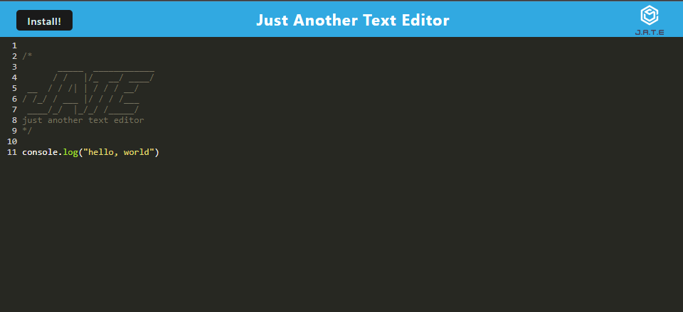
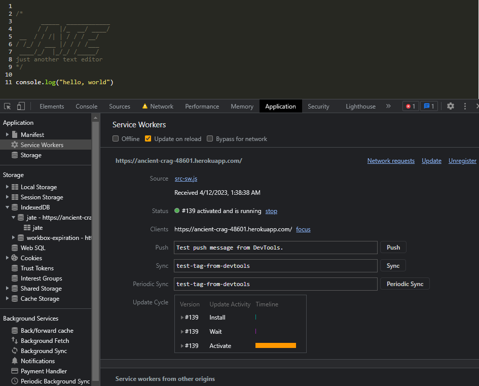

# Challenge 19 Text Editor

Week 10 DU Bootcamp Challenge

## Description

A web app that allows the use of the text editor JATE whether connected to the internet or not. An install button is included to place an icon on the user's desktop to launch. The input from the user is saved in a generated indexDB.

## Links

https://ancient-crag-48601.herokuapp.com/

## License

MIT

## Usage

Type in the editor and click the download button in the browser address bar.

 
 
 

